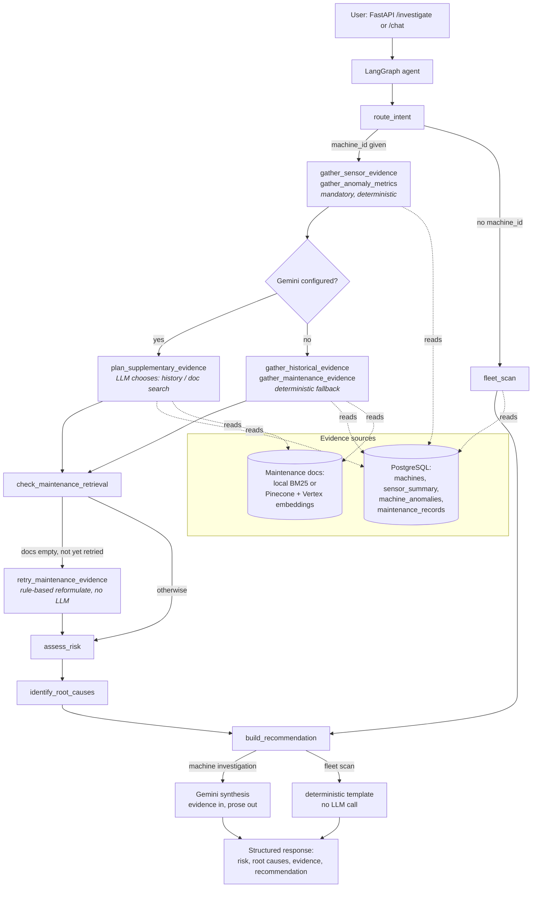

# Industrial Intelligence Agent

An AI operations decision-support system that investigates abnormal machine
behavior and returns evidence-backed maintenance recommendations — not a
chatbot that talks about factories, a system that queries sensor history,
maintenance records, and equipment documentation first, and only then lets
an LLM explain what the evidence says.

Built as a portfolio project demonstrating the skills for a Fresher
Python/AI Engineer role: PySpark data processing, PostgreSQL,
retrieval-augmented generation over a maintenance knowledge base, a
LangGraph agent with real tool use, Google Vertex AI / Gemini, and a
FastAPI + Streamlit application, containerized with Docker.

## Table of contents

- [Problem & business framing](#problem--business-framing)
- [Architecture](#architecture)
- [Data](#data)
- [Technology choices](#technology-choices)
- [Agent workflow](#agent-workflow)
- [PySpark pipeline](#pyspark-pipeline)
- [RAG pipeline](#rag-pipeline)
- [API](#api)
- [Multi-tenancy](#multi-tenancy)
- [Onboarding a tenant's own data](#onboarding-a-tenants-own-data)
- [Setup](#setup)
- [Example investigation](#example-investigation)
- [Testing](#testing)
- [Screenshots](#screenshots)
- [Limitations](#limitations)
- [Future improvements](#future-improvements)

## Problem & business framing

Factory operations teams see a flood of sensor telemetry and can't
manually correlate it with maintenance history and equipment documentation
fast enough to catch degradation before it becomes downtime. This system
answers operational questions —"why is M-17 underperforming?", "which
machines need inspection first?", "what changed?" — by gathering evidence
from four sources (sensor trend data, historical machine data, maintenance
records, and maintenance documentation) and only then having an LLM
synthesize what the evidence supports. The LLM never invents a statistic,
a risk level, or a machine ranking; those are computed deterministically
in Python/SQL before the LLM ever sees the question.

This is a portfolio demonstration against public and synthetic data —
**not** a system deployed at a real factory, and any business-impact
figures below are estimates, not measured outcomes.

## Architecture



Before any of this runs, the API layer resolves *which* machine (if any)
the request is actually about: the question text is parsed for machine
references (`app/agents/query_parser.py`) and reconciled with the optional
`machine_id` field — an unrecognized machine in the text is a 404, a
question naming several machines or a `machine_id` that disagrees with
the text is a 422, and a question naming none falls back to `machine_id`
or, absent that, a fleet scan. This is deliberately regex/set-membership,
not an LLM call — which machine a question names is a fact about the
text, not a judgement call. See `resolve_target` in `app/api/routes.py`.

A machine-specific question always gathers sensor and anomaly evidence
deterministically first — that pair can never be skipped, by either
branch below it, because risk assessment depends on it directly. What
varies is only the two *supplementary* evidence types (maintenance
history, documentation search): when Gemini/Vertex is configured, a real
LLM decides whether/how to gather them (`app/agents/planner.py`); when
it isn't, a deterministic fallback gathers both unconditionally. Either
way, a rule-based (no LLM) retry step reformulates and retries once if
the documentation search came back empty, before risk-assessment →
root-cause → Gemini-synthesis runs — identically regardless of which
branch gathered the evidence. A fleet-wide question ("which machines are
abnormal?") runs every machine through the *same* deterministic risk
rule and returns a ranked report without an LLM call at all — there's
nothing for a model to synthesize when the answer is already a sorted
list of numbers.

## Data

| Source | What it is | Used for |
|---|---|---|
| **UCI AI4I 2020 Predictive Maintenance** | Real public dataset | Machine failure/failure-type reference data (`ai4i_reference` table) |
| **Synthetic operational data** | Generated (`scripts/generate_synthetic_data.py`, seed=42) | 5-minute sensor readings for an 18-machine fleet, with 6 deliberately injected failure scenarios (TWF, HDF, PWF, OSF, RNF, TWF_RECURRING) so risk logic has known ground truth to test against |
| **Synthetic maintenance log** | Generated | Maintenance event history per machine |
| **Maintenance documentation** (`documents/`) | Written for this project | 7 markdown docs — SOPs, an equipment manual, a safety procedure, a troubleshooting guide, historical incident reports — chunked and embedded for RAG |

No real factory, real customer, or real sensor installation is represented
anywhere in this project. Where the fleet composition or scenario config
is need to be understood, see `spark_jobs/config.py` — every "magic
number" in the generator lives there, not scattered through code.

## Technology choices

| Choice | Why |
|---|---|
| **PySpark**, local mode, over Pandas | Demonstrates DataFrame transformations, window functions, and rolling aggregations at the scale/spirit of a distributed pipeline, even though this MVP's data volume doesn't strictly require a cluster |
| **PostgreSQL** for structured data | Relational integrity for machines/readings/anomalies/maintenance, and a place to demonstrate indexed, windowed SQL queries (see `get_fleet_sensor_trend`'s `ROW_NUMBER() OVER (PARTITION BY ...)`) |
| **BM25 (local) + Pinecone (cloud)** retrieval, switchable via `RAG_BACKEND` | The local path needs no credentials and is what the test suite runs against; the cloud path demonstrates real vector search when credentials are available |
| **LangGraph** over a hand-rolled state machine | Explicit state, explicit nodes, explicit conditional routing — the graph in `app/agents/graph.py` is the actual agent, not a wrapper around free-form LLM planning |
| **Gemini via Vertex AI**, Application Default Credentials | No API key in the codebase; auth is `gcloud auth application-default login` or a mounted service-account key |
| **FastAPI + Streamlit**, not React | Function and architecture over frontend polish for a 2-day MVP scope |

## Agent workflow

Nodes (`app/agents/graph.py`, `app/agents/nodes.py`):

1. **`route_intent`** — machine_id present → `machine_investigation`; absent → `fleet_scan`.
2. **`gather_sensor_evidence` / `gather_anomaly_metrics`** — mandatory and deterministic for every machine investigation, unconditionally. Risk assessment depends on these directly, so they are not a choice either evidence-gathering path below can make — see "Evidence-gathering: deterministic vs. LLM-planned" below.
3. **`gather_historical_evidence` / `gather_maintenance_evidence`** (deterministic fallback) **or `plan_supplementary_evidence`** (LLM-planned, when Gemini is configured) — the two *supplementary* evidence types only; each tool call is independently error-handled (a failed tool degrades the investigation, it doesn't crash it).
4. **`check_maintenance_retrieval` → `retry_maintenance_evidence`** — a rule-based (no LLM) retry: if the documentation search came back empty, reformulate the query (drop the machine-ID token, add an inferred failure-mode filter) and retry exactly once, regardless of which path in step 3 gathered evidence.
5. **`assess_risk`** — deterministic. Risk is based on the *sustained* anomalous-reading rate over the last 24 hourly windows (≥25% → HIGH, ≥5% → MEDIUM), not a single noisy hour. A lone WATCH snapshot is not enough on its own.
6. **`identify_root_causes`** — separates observed facts from correlations from possible causes; never lets the LLM claim proven causation.
7. **`build_recommendation`** — for a machine investigation, hands the assembled evidence to Gemini for synthesis (structured-output validated); for a fleet scan, builds the ranked report from `risk_level` directly, no LLM call.

Every node's execution is logged (which node, which machine, how long,
success or failure) — see `app/core/logging_config.py` and the tracing
wrapper in `graph.py`.

### Evidence-gathering: deterministic vs. LLM-planned

Sensor and anomaly evidence — the two inputs `assess_risk` depends on —
are gathered the same way every time, with no LLM anywhere near that
decision: there is no tool name, prompt, or planner state that could
cause them to be skipped. What genuinely varies is only whether the two
*supplementary* evidence types (maintenance history, documentation
search) are gathered by a fixed two-call sequence or by a real Gemini
tool-calling loop (`app/agents/planner.py`) that decides whether either
would help, given a summary of the evidence already gathered.

Which one runs is feature-detected, not a flag you have to remember to
flip: whenever `GOOGLE_CLOUD_PROJECT` is configured, the LLM-planned path
runs automatically (`AGENTIC_ROUTING_ENABLED` defaults to `true`);
`AGENTIC_ROUTING_ENABLED=false` is available as an explicit kill-switch
for a reproducible, fully-deterministic run without unsetting
credentials. Report *synthesis* (the final Gemini prose step, below) is
the opposite shape on purpose — it stays off by default even with
credentials present, and needs `GEMINI_SYNTHESIS_ENABLED=true` explicitly,
because swapping the recommendation's output source is a bigger
behavioural change than the planner choosing which evidence to fetch. Tested offline against a scripted fake Gemini 3 client
(`tests/test_planner.py`) — including a direct replay of a lazy/broken
planner that calls no tools at all, asserting the investigation still
comes back with the correct risk level, because the planner was never
given a tool that could affect it.

## PySpark pipeline

`spark_jobs/` (run via `scripts/run_pipeline.py`):

`ingestion.py` (load + validate) → `feature_engineering.py` (derived
features, AI4I failure flags, rolling features) →
`anomaly_detection.py` (z-score flags, risk score, `sensor_summary` /
`machine_anomalies` aggregation) → Parquet under `data/processed/` →
loaded into Postgres by `scripts/load_postgres.py`.

## RAG pipeline

`documents/*.md` → `app/rag/chunking.py` (chunk, ~900 chars with 150
overlap) → `data/processed/document_chunks.jsonl` (committed — see
`Dockerfile`'s comment on why) → embedded and indexed:

- `RAG_BACKEND=local`: BM25 lexical search over the JSONL, no network calls.
- `RAG_BACKEND=pinecone`: Vertex AI `gemini-embedding-001` embeddings, Pinecone similarity search.
- `RAG_BACKEND=auto`: picks `pinecone` only when both `PINECONE_API_KEY` and `GOOGLE_CLOUD_PROJECT` are set, else `local`.

## API

| Endpoint | Purpose |
|---|---|
| `GET /machines` | List the fleet |
| `GET /machines/rank-for-inspection` | Deterministic "inspect first" ranking by raw anomaly volume/severity since a given timestamp — a narrower, cheaper question than a fleet scan; doesn't run the LangGraph agent at all (registered ahead of `/machines/{machine_id}` so the literal path matches first) |
| `GET /machines/{machine_id}` | One machine's metadata |
| `GET /machines/{machine_id}/health` | Latest health window (defect rate, tool wear, anomaly counts, sustained-rate `risk_level`, computed by the same `assess_risk` a machine investigation uses) |
| `GET /machines/{machine_id}/anomalies` | Recent anomaly events |
| `GET /machines/{machine_id}/sensors` | Hourly sensor-history trend — backs the Streamlit trend chart |
| `GET /sensors` | This tenant's sensor registry (name, unit, normal range, z-score threshold, enabled) |
| `GET /machines/{machine_id}/readings` | Raw long-format readings for one machine (`sensor`, `start`, `end`, `limit` filters); 404 for another tenant's machine |
| `GET /healthz`, `GET /readyz` | Liveness (always 200) and readiness (`SELECT 1` against Postgres, else 503). No API key needed |
| `POST /investigate` | Full agent investigation. The target machine (if any) is resolved from both the question text and the optional `machine_id` field — see "Agent workflow" above; an unknown machine named in the question is a 404, an ambiguous request is a 422 |
| `POST /chat` | Same agent as `/investigate`, chat-shaped request/response (`message`/`reply`). Single-turn — no session memory; see the endpoint's own docstring for why that's a deliberate scope decision, not a gap |

Multi-tenant: the caller's `X-API-Key` decides which tenant's data every
route reads (see "Multi-tenancy" below) — there is no request field that
names one. `AUTH_REQUIRED=true` requires a valid key on every route above;
if `AUTH_REQUIRED` is unset it defaults to **true** when `API_KEY` is set or
`DATABASE_URL` points at a non-local host (anything but localhost / 127.x / ::1 —
so a compose service name like `postgres` counts as remote); only a local
database with no key keeps the zero-config demo posture, where a keyless request
acts as the demo tenant. `/investigate` and `/chat` are additionally rate-limited
(`RATE_LIMIT_PER_MINUTE`, default 30/min per tenant) since each triggers a
full evidence-gathering pass and, when configured, a billed Gemini call.

Full interactive docs at `/docs` once the API is running.

## Multi-tenancy

Every company-data table (`machines`, `sensor_summary`, `machine_anomalies`,
`maintenance_records`, `sensor_registry`, `sensor_readings`) carries `tenant_id`; every query in
`app/database/queries.py` requires it as a keyword-only argument and filters
on it — `tests/test_tenant_isolation.py::test_every_tenant_table_query_is_tenant_filtered`
statically checks that a new query can't skip this. Retrieval is scoped the
same way: each tenant gets its own BM25 chunk file / Pinecone namespace
(`app/rag/retriever.py`), so a tenant with no ingested documents gets an
empty index, never another tenant's manuals.

```bash
python scripts/manage_tenants.py create acme --name "Acme Manufacturing"   # prints an API key once
python scripts/manage_tenants.py list
python scripts/manage_tenants.py rotate-key acme
```

The demo tenant (`default`) is seeded by `sql/schema.sql` and keeps the
pre-tenancy chunk file / Pinecone namespace, so nothing already ingested
needs to be rebuilt.

## Onboarding a tenant's own data

A tenant's raw operational/maintenance export rarely matches this project's
column names or units. `app/onboarding/` bridges that: a JSON mapping
config (column names + declared units — see `app/onboarding/mapping.py`)
drives `app/onboarding/normalize.py`, which validates and unit-converts the
export into the exact schema `spark_jobs/ingestion.py` already processes —
so onboarding produces input to the *existing* pipeline, not a parallel one.

```bash
python scripts/onboard_tenant.py --print-example-mapping operational > mapping.json
# edit mapping.json for the tenant's own column names/units, then:
python scripts/onboard_tenant.py --tenant acme --name "Acme Manufacturing" \
    --operational-csv acme_export.csv --operational-mapping mapping.json
python scripts/run_pipeline.py --tenant acme
python scripts/load_postgres.py --tenant acme --processed-dir data/processed/tenants/acme
python scripts/ingest_documents.py --tenant acme   # if they have maintenance manuals
```

### Arbitrary sensors (any vocabulary)

A mapping can declare any set of sensors - name, source column, unit, optional
`target_unit` conversion, `normal_min`/`normal_max`, `z_score_threshold` - in
wide (one column per sensor) or long (sensor/value columns) layout. Units must
be in the catalog in `app/onboarding/units.py` (unknown units and
cross-dimension conversions are rejected). `"preset": "ai4i"` is one valid
mapping among others.

```bash
python scripts/onboard_tenant.py --print-example-mapping sensors > sensors.json
python scripts/onboard_tenant.py --tenant acme --name "Acme" \
    --sensor-csv readings.csv --sensor-mapping sensors.json   # add --allow-partial to keep good rows
python scripts/load_sensor_readings.py --tenant acme          # registry + machines + readings -> Postgres
python scripts/run_generic_pipeline.py --tenant acme          # Spark detection with acme's rules
```

Validation reports every bad row with line, column and a code (missing
machine_id/timestamp, bad timestamp, non-numeric, non-finite, duplicate,
conflicting duplicate, unmapped type). The file is rejected unless
`--allow-partial` is given. Detection rules come from `sensor_registry` +
`tenant_settings.config["anomaly"]`; defaults reproduce the AI4I behaviour
(`tests/test_anomaly_rules.py` compares against the committed parquet exactly).
The legacy AI4I-shaped path above is unchanged.

## Setup

### Local (no Docker)

```bash
pip install -r requirements-runtime.txt   # add requirements-cloud.txt too if using RAG_BACKEND=pinecone
cp .env.example .env                      # then edit DATABASE_URL etc. for your Postgres
psql -U postgres -c "CREATE DATABASE industrial_intelligence"
alembic upgrade head                      # applies sql/schema.sql's exact schema — see "Migrations" below
python scripts/run_pipeline.py            # PySpark: needs a local JVM (Java 8/11/17)
python scripts/load_postgres.py
python scripts/ingest_documents.py
uvicorn app.main:app --reload             # API on :8000
streamlit run frontend/streamlit_app.py   # UI on :8501, separate terminal
```

### Migrations

`sql/schema.sql` (used by `docker compose up`'s init scripts and by CI) and
`alembic upgrade head` produce byte-for-byte the same schema —
`tests/test_migrations.py` checks this on every run, so they cannot drift.
To change the schema: add a migration under `migrations/versions/`, then
update `sql/schema.sql` to match. An existing pre-tenancy deployment
upgrades in place — `alembic upgrade head` backfills every existing row
into the demo tenant, verified by
`tests/test_migrations.py::test_upgrading_a_populated_pre_tenancy_database_keeps_every_row`.

### Docker

```bash
cp .env.example .env   # set POSTGRES_PASSWORD and API_KEY (both required)
docker compose up --build
```

Compose refuses to start without `POSTGRES_PASSWORD` and `API_KEY` (no hardcoded defaults), and Postgres is bound to 127.0.0.1 only. Postgres seeds itself on first start from
`sql/schema.sql` + `sql/seed.sql.gz` — the exact rows the PySpark pipeline
and `scripts/load_postgres.py` produce (18 machines, 25,920 hourly
sensor-summary rows, 28,855 anomaly events, 7 maintenance records, 10,000
AI4I reference rows) — so the API and frontend are populated on the first
run, with no separate loader step and no local Python/pandas/JVM required
for the Docker path. `docker compose down -v` clears the seeded volume if
you want a clean re-seed.

For the Pinecone + Vertex AI path instead of the local demo, see
`docker-compose.yml`'s own usage comment — it's a one-line environment-variable
flip (`INSTALL_CLOUD_DEPS=true RAG_BACKEND=pinecone ...`), not a file edit.

## Example investigation

`POST /investigate {"machine_id": "M-04", "question": "Why is M-04 underperforming?"}`

M-04 carries an injected, **unresolved** overstrain-failure (OSF) scenario
in the synthetic data — the fleet's one machine that should come back
non-LOW. The agent:

1. Pulls M-04's latest health window and 24-hour sensor trend from Postgres.
2. Finds a sustained high anomalous-reading rate across those windows (not just one noisy hour).
3. Pulls recent `machine_anomalies` rows and maintenance history — no repair event recorded for this scenario.
4. Retrieves the relevant SOP/troubleshooting sections from the maintenance knowledge base.
5. `assess_risk` returns **HIGH** from the sustained-rate rule.
6. Gemini synthesizes the evidence into the response's `## Possible causes`, `## Supporting evidence`, and `## Recommended action` sections — it does not compute the risk level, it explains a risk level that was already computed.

A fleet-wide `POST /investigate {"question": "which machines need inspection?"}`
runs all 18 machines through the same rate rule and returns them ranked,
worst first — the same `risk_level` a machine-specific investigation of
any one of them would report.

## Testing

```bash
pytest -m "not dense"    # everything except live Pinecone/Vertex calls — needs Postgres for the DB-backed tests
pytest -m dense          # live Pinecone + Vertex AI calls — needs real credentials
```

Last full run (Postgres 16, no cloud SDKs, `-m "not dense and not load"`): 358 passed, 0 failed,
10 skipped (cloud-SDK/credential tests), 18 deselected. Tests assert against **known ground truth** from the six
injected failure scenarios (`spark_jobs/config.py`), not generic sanity
checks — plus a dedicated adversarial check
(`tests/test_tenant_isolation.py`) that one tenant's API key can never
reach another tenant's machines, evidence, or documents, even when they
share a machine id.

CI (`.github/workflows/tests.yml`) runs `pytest -m "not dense"` on every
push and PR against an ephemeral `postgres:16-alpine` service container,
applying the schema via `alembic upgrade head` (so the migration chain
itself is exercised in CI, not just proven equivalent to `sql/schema.sql`
by `tests/test_migrations.py`) and then loading `sql/seed.sql.gz` — the
same seed `docker compose up` uses, so CI and the Docker demo stay backed
by the same data.

## Screenshots

*Not included in this repository snapshot — add screenshots of the
Streamlit dashboard (machine selector, health summary, anomaly
indicators, investigation results) and a sample `/docs` call here before
sharing this as a portfolio piece.*

## Limitations

- **Synthetic data, not a real deployment.** Sensor readings, maintenance events, and the fleet itself are generated; only the AI4I reference dataset is real public data.
- **`/chat` is single-turn.** It runs the same agent as `/investigate`, but doesn't remember previous messages — see the endpoint's docstring.
- **PySpark needs a local JVM.** `pytest -m "not dense"` will show `JAVA_GATEWAY_EXITED` errors on `tests/test_pipeline.py` if Java 8/11/17 isn't installed and on `PATH`/`JAVA_HOME`; this is an environment requirement, not a code bug.
- **Risk thresholds are calibrated on synthetic data.** The 25%/5% sustained-rate cutoffs in `app/agents/risk.py` are tunable starting points validated against this project's injected scenarios, not clinically/industrially validated limits.
- **Generic-sensor engine limits (Phase 1).** Composite failure rules exist only for the AI4I pack; other tenants get per-sensor z-score and range rules. There is no minimum baseline, so a machine's first readings can false-flag; the rolling window counts readings, not wall-clock time; sparse sensors yield NULLs (treated as not-flagged). Hourly per-sensor aggregates are only stored for AI4I columns, so `/machines/{id}/sensors` trends and the dashboard remain AI4I-oriented (use `/machines/{id}/readings` for other sensors). Spark reads onboarding files, not Postgres via JDBC.
- **Not verified:** `docker compose up` (only `docker compose config`), the ~2.5M-row `--ai4i-demo` long-format load, and `-m dense` tests.
- **Docs referenced a `manage_tenants.py calibrate` command that does not exist.** Tenant anomaly settings are written via `queries.merge_tenant_anomaly_settings` (no CLI yet).
- **Docker's cloud path is opt-in and unverified end-to-end in this repo's automated tests** — `pytest -m dense` and a real `docker compose up` with real credentials are the only ways to confirm the Pinecone/Vertex path actually returns different output than the local path.

## Future improvements

- Multi-turn `/chat` with session state, if a live demo specifically needs follow-up questions.
- A reranking step in the RAG pipeline (currently top-k lexical/vector search with no reranker).
- Structured-output schema validation on the fleet-scan path too (currently only the Gemini-synthesis path validates against a schema).